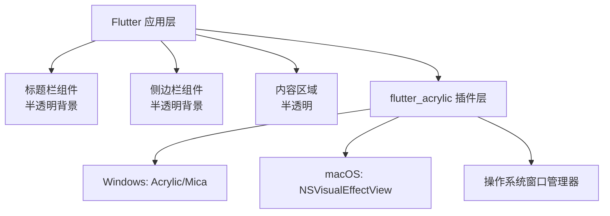

## 产品概述

将 Flutter 桌面客户端的主窗口修改为磨砂玻璃透明风格，支持 Windows 和 macOS 平台，提升视觉体验和现代感。

## 核心功能

- 整个窗口背景（标题栏 + 内容区）应用磨砂玻璃效果
- 左侧菜单栏与右侧内容区间距从当前的 16px 调整为 5px
- 窗口底部背景完全透明，显示桌面背景
- 支持 Windows（Acrylic/Mica 效果）和 macOS（NSVisualEffectView）平台
- 保持现有功能和交互逻辑不变

## 技术栈选择

- **核心框架**: Flutter + Dart
- **磨砂玻璃效果**: flutter_acrylic ^1.3.0（提供 Windows/macOS 原生磨砂效果支持）
- **窗口管理**: window_manager ^0.4.3（已有依赖，继续用于窗口控制）

## 实现方案

### 策略概述

使用 `flutter_acrylic` 包调用各平台原生 API 实现磨砂玻璃效果。Windows 平台使用 Acrylic 或 Mica 效果，macOS 平台使用 NSVisualEffectView。通过修改窗口初始化配置启用透明背景，并在 Flutter UI 层使用半透明颜色实现磨砂玻璃视觉效果。

### 关键技术决策

1. **选择 flutter_acrylic 而非纯 Flutter BackdropFilter**

- 原因：`flutter_acrylic` 调用原生 API，性能更好，效果更原生
- Windows: 支持 Acrylic（Win10）和 Mica（Win11）效果
- macOS: 使用 NSVisualEffectView 实现原生磨砂效果
- Trade-off: 需要添加新依赖，但效果远超 Flutter 层实现

2. **窗口透明背景配置**

- 修改 `main.dart` 中的 WindowOptions，设置 `backgroundColor: Colors.transparent`
- 在窗口显示后调用 `acrylic.Window.setEffect()` 应用磨砂效果
- 为 macOS 配置 Info.plist 支持透明窗口

3. **左侧菜单与右侧间距调整**

- 修改 `lib/features/chat/presentation/chat_page.dart` 第 48 行
- 将 `SizedBox(width: 16)` 改为 `SizedBox(width: 5)`

4. **底部透明实现**

- 确保 Scaffold、desktop_window_frame 和内容区域底部不设置不透明背景
- 内容区域使用透明或半透明背景色

### 性能考虑

- `flutter_acrylic` 使用原生 API，性能开销极小
- 操作系统合成器处理磨砂效果，不影响 Flutter 渲染性能
- 避免在 Flutter 层使用多个嵌套 BackdropFilter

### 实现注意事项

**日志记录：**

- 复用项目现有日志模式
- 记录窗口效果设置的成功/失败状态
- 避免记录敏感信息

**影响范围控制：**

- 仅修改窗口样式相关文件，不影响业务逻辑
- 保持向后兼容，不影响现有功能
- 使用特性检测而非平台硬编码

### 架构设计

**系统架构图：**



**数据流：**
窗口初始化 → 设置透明背景 → 应用磨砂效果 → Flutter UI 层半透明渲染 → 操作系统合成器合成最终效果

### 目录结构

```
flutter_client/
├── lib/
│   ├── main.dart                              [MODIFY] 窗口初始化配置，启用透明背景和应用磨砂效果
│   ├── app/
│   │   └── desktop_window_frame.dart          [MODIFY] 标题栏改为半透明磨砂效果，背景色改为透明
│   └── features/
│       ├── chat/presentation/
│       │   └── chat_page.dart                 [MODIFY] 左侧菜单间距改为5px，内容区背景透明
│       └── session/presentation/
│           └── session_sidebar.dart           [MODIFY] 侧边栏改为半透明磨砂效果
├── macos/
│   └── Runner/
│       └── Info.plist                        [MODIFY] 添加透明窗口支持配置（macOS）
└── pubspec.yaml                                [MODIFY] 添加 flutter_acrylic 依赖
```

### 文件修改详细说明

1. **pubspec.yaml** [MODIFY]

- 用途：添加项目依赖
- 功能：在 dependencies 下添加 `flutter_acrylic: ^1.3.0`
- 实现要求：遵循现有依赖版本约束格式，添加后运行 flutter pub get

2. **lib/main.dart** [MODIFY]

- 用途：应用程序入口和窗口初始化
- 功能：配置窗口透明背景，应用磨砂玻璃效果
- 实现要求：
    - 导入 `package:flutter_acrylic/flutter_acrylic.dart`
    - 修改主窗口的 WindowOptions（第 47-53 行），设置 `backgroundColor: Colors.transparent`
    - 在 `waitUntilReadyToShow` 回调中调用 `Window.setEffect()`
    - Windows 推荐使用 `WindowEffect.mica`（Win11）或 `WindowEffect.acrylic`（Win10）
    - macOS 使用 `WindowEffect.acrylic`（映射到 NSVisualEffectView）

3. **lib/app/desktop_window_frame.dart** [MODIFY]

- 用途：自定义标题栏框架
- 功能：标题栏背景改为半透明磨砂效果
- 实现要求：
    - 第 46 行：修改 Scaffold 的 `backgroundColor` 为 `Colors.transparent`
    - 第 81-95 行：标题栏 Container 的 `color` 改为半透明（如 `Colors.white.withValues(alpha: 0.7)`）
    - 保留阴影和边框效果，确保标题栏层次感

4. **lib/features/chat/presentation/chat_page.dart** [MODIFY]

- 用途：主聊天页面布局
- 功能：调整左侧菜单间距，内容区域应用透明效果
- 实现要求：
    - 第 48 行：将 `SizedBox(width: 16)` 改为 `SizedBox(width: 5)`
    - 第 54 行：Card 的 child 内容区域背景改为透明或半透明
    - 确保底部区域（DAG 面板下方）完全透明

5. **lib/features/session/presentation/session_sidebar.dart** [MODIFY]

- 用途：会话侧边栏
- 功能：侧边栏背景改为半透明磨砂效果
- 实现要求：
    - 第 23 行：Card 的 `color` 改为半透明（如 `Colors.white.withValues(alpha: 0.6)`）
    - 或使用 Container 替代 Card，设置半透明背景色
    - 保持现有的圆角（默认 Card 圆角）和内边距样式

6. **macos/Runner/Info.plist** [MODIFY]（仅 macOS）

- 用途：macOS 应用配置
- 功能：添加透明窗口支持
- 实现要求：在 `<dict>` 标签内添加以下键值以支持透明背景：

```xml
<key>NSWindowShouldUseTextureBackground</key>
<true/>
```

### 平台差异处理

| 平台 | 磨砂效果实现 | 注意事项 |
| --- | --- | --- |
| Windows 10 | Acrylic 效果 | 需要设置 backgroundColor 为透明 |
| Windows 11 | Mica 效果（推荐）或 Acrylic | Mica 效果更符合 Win11 设计语言 |
| macOS | NSVisualEffectView | 需要在 Info.plist 中配置 |
| Linux | 通用透明效果 | 暂不单独优化，保持透明背景 |


### 测试计划

1. Windows 平台测试：验证 Acrylic/Mica 效果是否正确显示
2. macOS 平台测试：验证 NSVisualEffectView 效果是否正确显示
3. 视觉测试：验证磨砂效果、透明度、文字可读性
4. 交互测试：验证窗口拖拽、按钮交互是否正常
5. 性能测试：验证磨砂效果是否影响渲染性能

## 设计风格

采用 Glassmorphism（磨砂玻璃）设计风格，结合透明和模糊效果，营造现代、轻盈的视觉体验。整个窗口呈现通透感，内容区域悬浮在桌面上，为用户带来沉浸式的视觉体验。

## 应用场景

Flutter 桌面端应用（Windows + macOS），窗口主界面。用户在使用 Agent 客户端时，能够透过窗口看到桌面背景，提升视觉层次感和现代感。

## 设计内容描述

### 整体页面结构

窗口分为标题栏区（顶部，高度 52px）、侧边栏区（左侧，宽度 280px）、内容区域（右侧，自适应）和底部透明区。整体使用磨砂玻璃效果，底部保持完全透明以显示桌面背景或其他应用窗口。

### 标题栏区块（顶部，52px 高度）

- 背景：半透明白色（alpha 0.7-0.8），呈现磨砂效果
- 左侧：应用图标（蓝色圆形，12x12px） + 标题文字（粗体） + 副标题（灰色，较小字体）
- 右侧：自定义窗口控制按钮（最小化、最大化/还原、关闭）
- 底部：细微分割线（Color(0xFFE6EAF0)），营造层次感
- 阴影：轻微的阴影效果，增强悬浮感

### 侧边栏区块（左侧，280px 宽度）

- 背景：半透明白色/浅灰色（alpha 0.6-0.7），圆角 12px
- 内边距：16px
- 内容：会话列表标题 + 新建会话按钮 + 会话列表 + 设置按钮
- 选中项：使用半透明主色调（Color(0x331565C0)）高亮
- 与右侧内容区间距：5px（原 16px）

### 内容区域区块（右侧，自适应宽度）

- 背景：半透明白色（alpha 0.5-0.6），圆角 12px
- 上方区域（flex: 3）：消息列表 + 输入栏，Card 组件包裹
- 下方区域（flex: 2）：日志面板 + DAG 面板，左右排列
- 底部：完全透明，无背景色遮挡，显示桌面背景

### 底部透明区块

- 整个内容区域底部不设置背景
- 保持窗口透明，可看到桌面或其他应用
- 确保 DAG 面板下方区域完全透明

### 交互设计

- 按钮悬停：微妙的背景色变化（使用现有 _HoverWindowButton 组件）
- 侧边栏选中项：半透明主色调高亮，圆角 12px
- 窗口控制按钮：关闭按钮悬停时使用红色背景（保持现有设计）
- 输入框：半透明背景，聚焦时边框高亮

### 响应式设计

- 窗口最小尺寸：1080x720（保持现有配置）
- 侧边栏：固定宽度 280px
- 内容区域：自适应宽度，保持合适的内边距
- 窗口最大化时：磨砂效果应覆盖整个屏幕